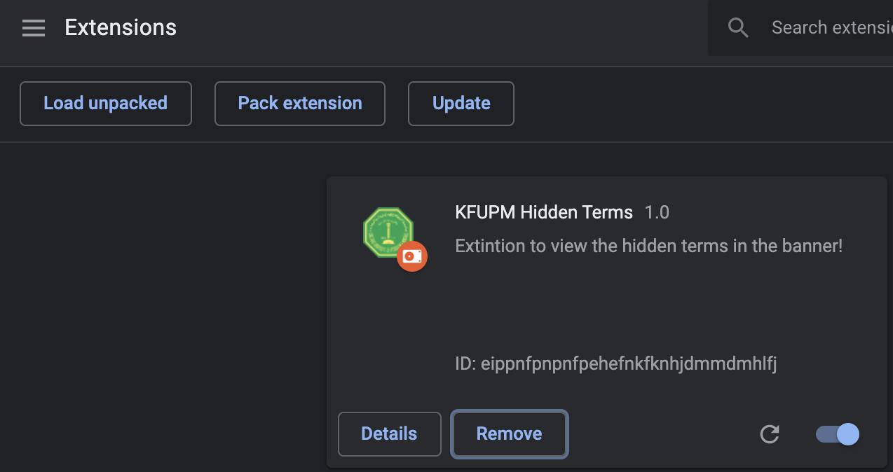
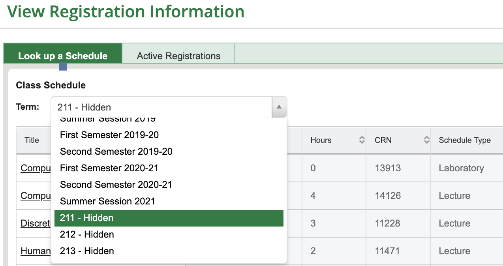

# KFUPM Hidden Terms
Extension to view the hidden terms in the banner!

### Adding to Chrome

Open Google Chrome and open the Extension Management page by navigating to ```chrome://extensions``` or by opening Settings and clicking Extensions from the bottom left.

Enable Developer Mode by clicking the toggle switch next to Developer mode.

Click the "Load Unpacked" button and select the extension Folder.

<p align="center">
  
<p/>

Voila! The extension is now installed and ready to be used!

<p align="center">
  
<p/>
